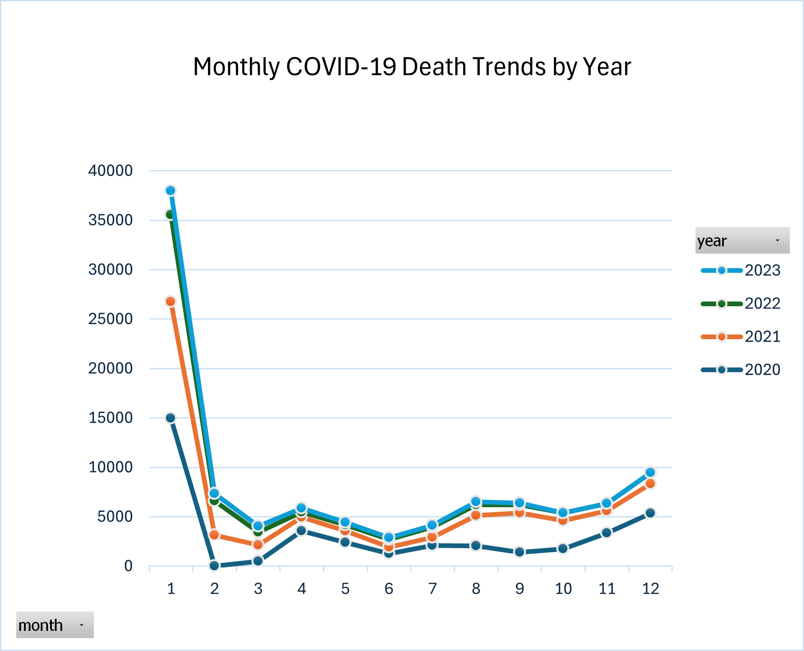
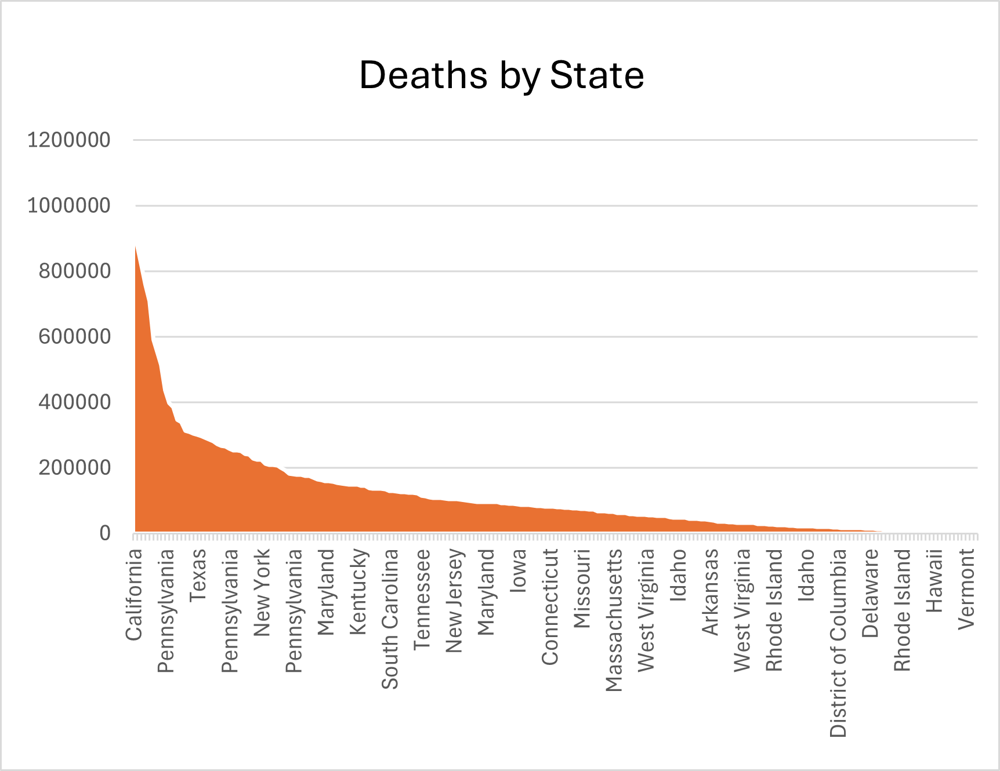
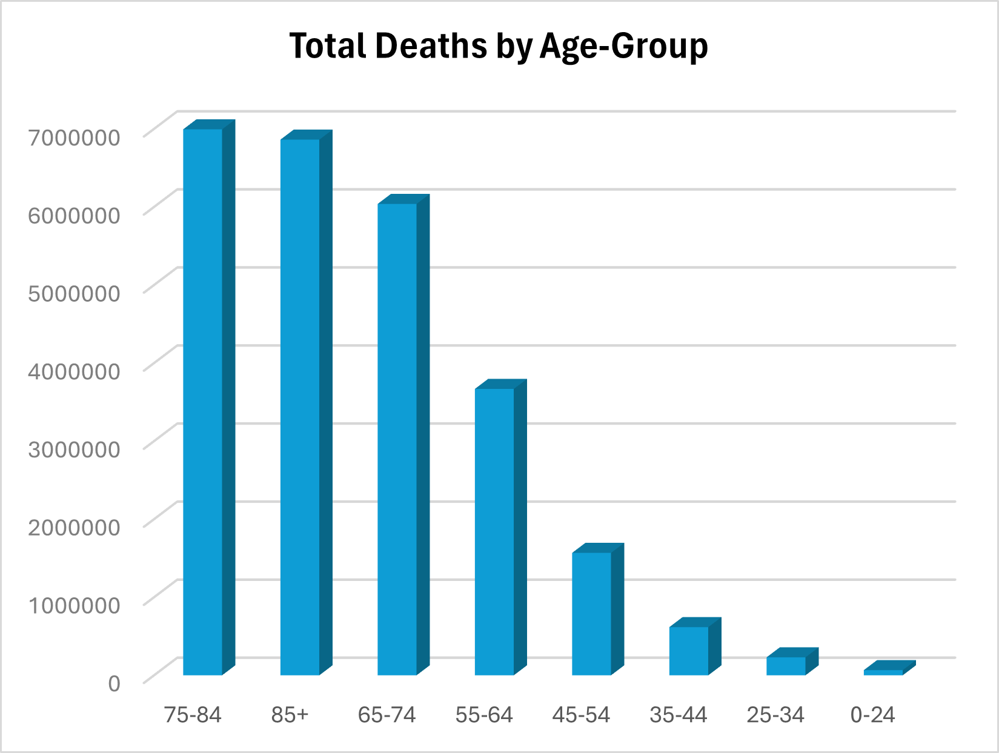
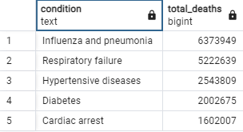

# COVID-19 Contributing Factors – SQL Analysis Project

## Project Overview
Analyzed CDC’s COVID-19 Contributing Factors dataset using SQL to uncover patterns in mortality by state, age group, and health conditions. This project highlights healthcare analytics techniques useful for public health informatics.

---

## Objectives
- Clean and validate COVID-19 death data

- Analyze trends over time and across demographics

- Rank states by total COVID-19 deaths annually

- Identify top contributing health conditions

- Compare deaths with and without contributing factors

---

### Files
- File	Description
covid-sql-analysis/
│
├── assets/
│ ├── top_conditions.png
│ ├── deaths_by_age_group.png
│ └── monthly_trends_by_year.png
│
├── covid_19.sql
├── README.md
---

### Dataset Description
- Source: CDC’s COVID-19 Contributing Factors (CSV)

**Key Fields:**

state, age_group, condition

start_date, end_date, covid_deaths, number_of_mentions

flags, icd10_codes, condition_group

---

**Tools & Technologies**
- PostgreSQL (via pgAdmin)

- SQL window functions: RANK(), DENSE_RANK()

- Aggregations: SUM(), AVG()

- Date functions: EXTRACT(), DATE_TRUNC()

- Data quality checks: DISTINCT, COUNT(), HAVING

---

**Key SQL Analyses**

- Total COVID-19 deaths per state and year

- Death distribution by age group and health condition

- Monthly death trends

- Most common contributing conditions per state

- States with >5000 deaths in any year

- Rank states annually by total deaths

- Compare deaths with vs. without contributing conditions by age

- Average contributing conditions per death

- Detecting unknown or irregular flags

---

**Key Findings**

- States: Some states consistently had higher death counts, especially in 2021 & 2023.

- Age Groups: Seniors (65+) showed the highest mortality.

- Contributing Factors: Pneumonia, respiratory failure, hypertension, and diabetes were common.

- Data Quality: Several records had unknown or unclassified flags requiring attention.

---

## Visualization

### Monthly COVID-19 Death Trends by Year

### COVID-19 Deaths by State

### COVID-19 Deaths by Age Group

### Top conditions (Query Output)

---

**Author:**

Mahwish Malik
Master’s Student – Health Informatics
Passionate about data analytics, healthcare systems, and SQL-based insights.
